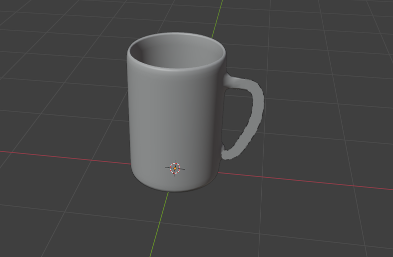

# Présentation du Projet | Project Presentation

## FR :

Ce projet consiste en la modélisation 3D d'un mug avec Blender. C'est un projet que j'ai réalisé grâce au club de modélisation 3D de mon école : Model'IT.

### Comment Utiliser

1. Clonez le dépôt sur votre machine locale.
2. Assurez-vous d'avoir Blender installé sur votre machine.
3. Ouvrez le fichier `mug.blend` dans Blender.
4. Explorez le modèle et modifiez-le si besoin.

### Technologies Utilisées

- Blender

## ENG :

This project represents my individual effort to create a 3D model of a mug using Blender. This is a project I completed alone during my summer vacation, aimed at improving my skills in 3D modeling and design.

### How to Use

1. Clone the repository to your local machine.
2. Make sure you have Blender installed on your machine.
3. Open the `mug.blend` file in Blender.
4. Explore the model and modify it as needed.

### Technologies Used

- Blender

---

## Ce que j'ai appris | What I Learned

## FR :

À travers ce projet, j'ai développé des compétences essentielles en modélisation 3D avec Blender. J'ai appris à concevoir et à implémenter des objets 3D, à gérer les textures et les matériaux, et à améliorer mes compétences en design graphique. Ce projet m'a permis de renforcer ma compréhension des concepts de base de la modélisation 3D.

## ENG :

Through this project, I developed essential skills in 3D modeling with Blender. I learned to design and implement 3D objects, manage textures and materials, and enhance my graphic design abilities. This project helped me strengthen my understanding of fundamental 3D modeling concepts.

---

## Auteur | Author

- [Nassim EL HADDAD](https://www.linkedin.com/in/nassim-el-haddad-4aa298271/)

---

### Liens Utiles | Useful Links

- [Blender](https://www.blender.org/)

---

### Image

